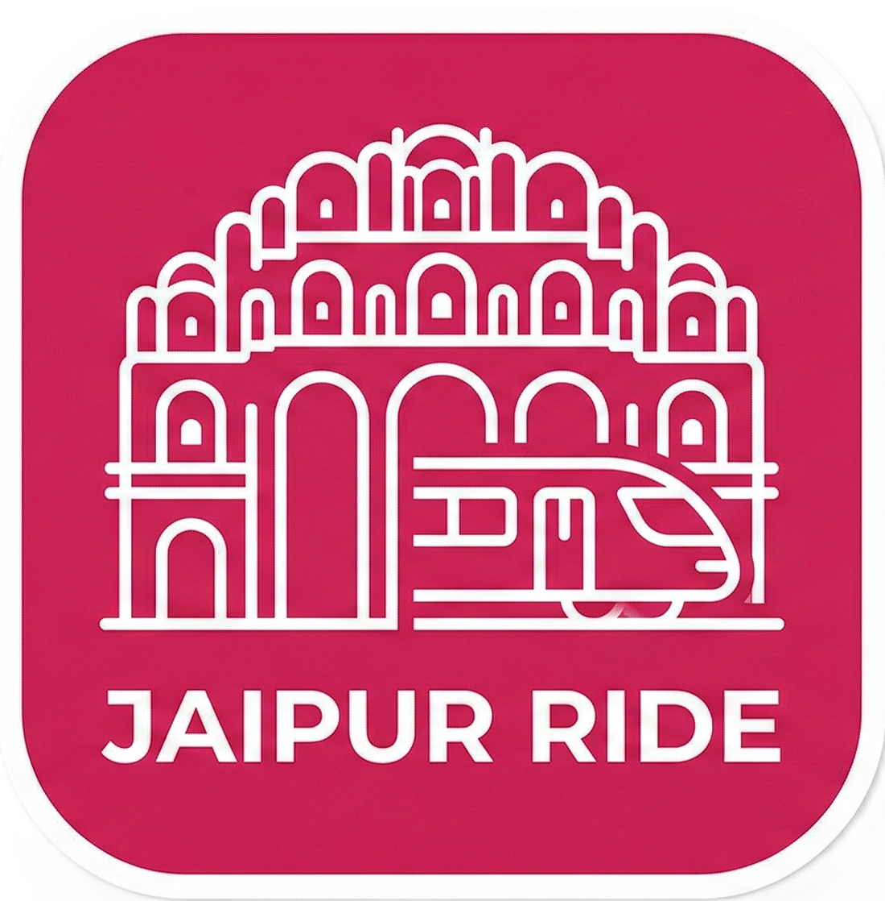

# 🚇 Jaipur Ride — Official Website & Guide (V2)

<div align="center">
  
  
  ### The official marketing, guide, and simulation website for Jaipur Ride Android App
  
  [](#)
  [](LICENSE)
  [](https://nextjs.org)
  [](https://tailwindcss.com)
</div>

---

## 📸 Interface Preview

<div align="center">
  <h3>Hero Banner & Premium Dark Mode</h3>
  
</div>

<br />

<div align="center">
  <table>
    <tr>
      <td align="center" width="50%">
        <strong>📱 Route Planner Interface</strong><br />
        
      </td>
      <td align="center" width="50%">
        <strong>🚇 Live Journey tracking (Android Only)</strong><br />
        
      </td>
    </tr>
  </table>
</div>

---

## ✨ Key Features & Marketing Sections

- **Interactive SVG Route Map**: Seamlessly highlights elevated vs. underground stations with custom vector markers.
- **Dynamic Fare & Route Simulator**: Offline-first planner in React for computing cash/smart-card fares, intermediate stops, and platform designations.
- **Sightseeing Integration**: Promotes local tourism by mapping landmarks (like Hawa Mahal, Amer Fort) to their nearest stations with walking/driving times.
- **Offline Sideload Center**: Dedicated center providing QR code scanners, direct APK downloads, hardware permissions explainers, and installation guides.

<div align="center">
  <h3>Sightseeing Integration Example</h3>
  
</div>

---

## 🛠️ Technology Stack

- **Framework**: [Next.js 15+](https://nextjs.org/) (App Router, dynamic page rendering)
- **Language**: [TypeScript](https://www.typescriptlang.org/) (Type-safe data mapping)
- **Styling**: [Tailwind CSS v4](https://tailwindcss.com/) (Premium colors and responsive grids)
- **Animations**: [Framer Motion](https://www.framer.com/motion/) (Smooth page/element transitions)
- **Form Handling**: [React Hook Form](https://react-hook-form.com/) & [Zod](https://zod.dev/) (Form schemas and validations)
- **Icons**: [Lucide Icons](https://lucide.dev/) (Consistent iconography)

---

## 📁 Project Structure

```
website/
├── public/                 # Static assets (logos, screenshots, release APKs)
│   ├── images/             # Tourist attraction photography assets
│   ├── release/            # Compiled Android APKs for sideloading
│   ├── logo1.png           # App icon logo
│   └── manifest.json       # PWA manifest metadata
├── src/
│   ├── app/                # Page routing directory
│   │   ├── about/          # Story & project roadmap
│   │   ├── contact/        # Feedback validation forms
│   │   ├── download/       # Sideload apk guides and perm explanations
│   │   ├── explore-jaipur/ # Heritage tourism guide mapping
│   │   ├── features/       # Features grid comparison matrix
│   │   ├── journey-planner/# Web simulator route planning
│   │   ├── metro-map/      # Interactive SVG line maps page
│   │   ├── metro-stations/ # Stations directory and detailed nodes [id]
│   │   ├── globals.css     # Global styles & theme colors
│   │   ├── layout.tsx      # Root html shell & JSON-LD schemas
│   │   ├── page.tsx        # Homepage landing template
│   │   ├── sitemap.ts      # Dynamic sitemap indexer
│   │   └── robots.ts       # Crawling rules
│   ├── components/         # Reusable elements (Navbar, Footer, SVG Map, SVG Phone)
│   ├── context/            # Global context (Language switching, theme managers)
│   └── data/               # Static JSON databases (stations, fares, faqs)
```

---

## 💾 Local Development

### 1. Install Dependencies
```bash
# Navigate to the website directory
cd website

# Install packages
npm install
```

### 2. Run the Development Server
```bash
npm run dev
```
Open [http://localhost:3000](http://localhost:3000) in your browser.

### 3. Build for Production
```bash
npm run build
```

---

## 📊 Static Database Architecture (JSON)

All information is managed through static database files located in `src/data/`:
- **`stations.json`**: Directory of stations, first/last train timings, lift/parking amenities, and geographic coordinates.
- **`routes.json`**: Graph connection links mapping node travel times and distances. Support interchanges and multi-line additions.
- **`fares.json`**: Fare brackets based on station counts, and smart-card/senior citizen discounts.
- **`tourism.json`**: Catalog of sights, walk times from closest metro nodes, and ticket pricing.
- **`faq.json`**: Common questions and answers translated in both English and Hindi.
- **`statistics.json`**: Download and active user counts.

---

## 🚀 Deployment (Vercel)

The website is configured to be deployed on **Vercel** with zero configuration:
1. Link your git repository to Vercel.
2. In the Vercel Project Settings, set the **Root Directory** to `website/`.
3. Vercel will automatically detect Next.js and build, optimize, and deploy the application.
